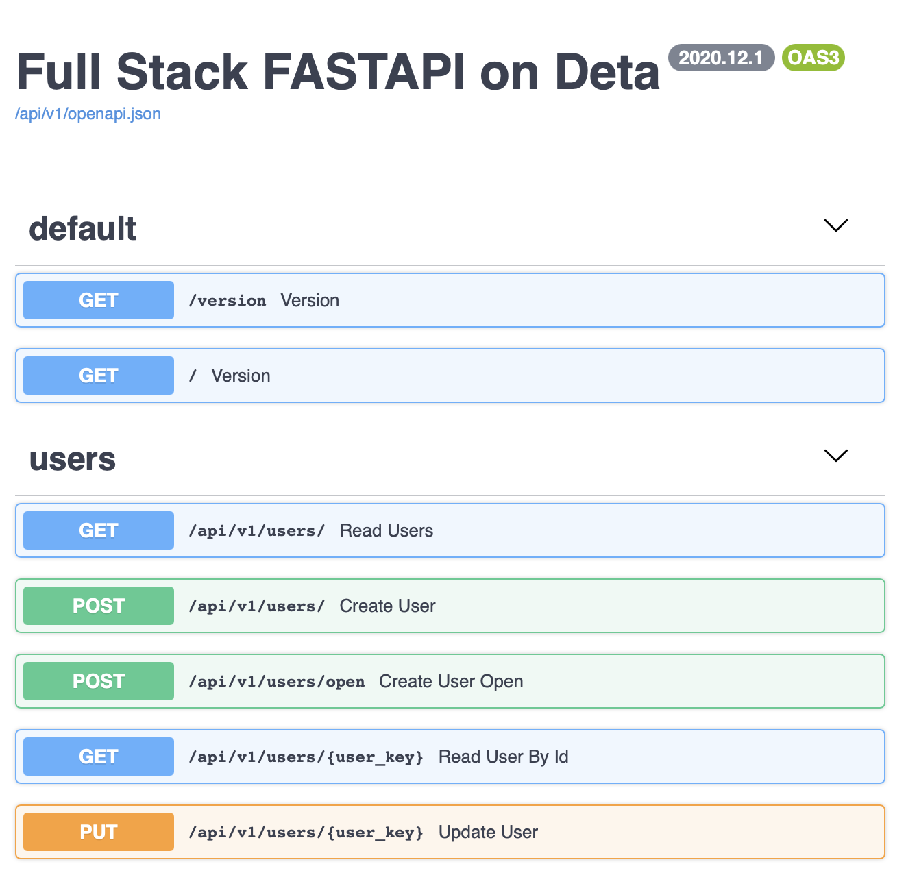

<h1 align="center" style="margin:1em">
  
      Full-stack FastAPI on Deta
</h1>

<h4 align="center">
None of this would have been possible without the fantastic work put into Tiangolo's <a href="https://github.com/tiangolo/fastapi">FastAPI</a> :rocket:. 

And from the <a href="https://github.com/deta">Deta team</a> :fireworks:.
  
Thanks!

</h4>

    
    

 

## Context

Both Tiangolo and Deta team already give a bit of information on how to bridge fastAPI and Deta, [here](https://docs.deta.sh/docs/tutorials/fast-api-guide) and [there](https://fastapi.tiangolo.com/deployment/deta/?h=+deta)

I would like to go further, and follow the path Tiangolo has made with its full-stack generators for postgreSQL and Docker. Except it would be with Deta Bases and Micros.

At the same time, I will try to go there step by step, incrementally. Hence the idea to use different branches for different use cases.

## What's here

This branch, `01-users`, focus on the implementation of the CRUD operations on `users`

The inventory of all the branches is available on [`master`](https://github.com/ebreton/full-stack-fastapi-deta/tree/master), more specifically within its README file

## Features

**Disclaimer:** I have removed all the security in this first implementation. DO NOT USE IN PRODUCTION.

End of disclaimer (but still do not use in production)

A subset of [Tiangolo's FastAPI generator](https://github.com/tiangolo/full-stack-fastapi-postgresql):

* CRUD operations for basic users
* Generated documentation with Swagger and reDoc
* Python <a href="https://github.com/tiangolo/fastapi" class="external-link" target="_blank">**FastAPI**</a> backend:
    * **Fast**: Very high performance, on par with **NodeJS** and **Go** (thanks to Starlette and Pydantic).
    * **Intuitive**: Great editor support. <abbr title="also known as auto-complete, autocompletion, IntelliSense">Completion</abbr> everywhere. Less time debugging.
    * **Easy**: Designed to be easy to use and learn. Less time reading docs.
    * **Short**: Minimize code duplication. Multiple features from each parameter declaration.
    * **Robust**: Get production-ready code. With automatic interactive documentation.
    * **Standards-based**: Based on (and fully compatible with) the open standards for APIs: <a href="https://github.com/OAI/OpenAPI-Specification" class="external-link" target="_blank">OpenAPI</a> and <a href="http://json-schema.org/" class="external-link" target="_blank">JSON Schema</a>.
    * <a href="https://fastapi.tiangolo.com/features/" class="external-link" target="_blank">**Many other features**</a> including automatic validation, serialization, interactive documentation, authentication with OAuth2 JWT tokens, etc.
* REST backend tests based on **Pytest**

## Technical mindset for this 1st branch

Focus on getting fastAPI deployed on a Micro and a BaseBD within a minimalistic environment

Adds a bit of tests and code linting on the top of it. A version to know where the application stands. And more on the next iteration.

## Tree architecture

    full-stack-fastapi-deta
    ├── backend
    │   ├── core
    │   ├── email-templates
    │   ├── schemas
    │   └── users
    │       └── api_v1
    └── tests
        ├── api
        │   └── api_v1
        ├── crud
        └── utils

- `backend` is the root directory for the Micro.
  > It should go into your `PYTHONPATH` too (see `.env`)
- a CRUD scafeholding is provided in `core`
  > keep as DRY as possible
- isolate the user features in one package `users`
  > will facilitate the implementation of multi micros in later branches
- expose the `schemas` outside of the package
  > will act as the contract between micros

## Installation

### Getting the right versions

Deta use python runtime 3.7.9.

It will avoid bad surprises to adapt your environment:

    $ brew install pyenv (check details on official doc)
    $ CFLAGS="-I$(brew --prefix openssl)/include -I$(brew --prefix readline)/include -I$(xcrun --show-sdk-path)/usr/include" \
        LDFLAGS="-L$(brew --prefix openssl)/lib -L$(brew --prefix readline)/lib -L$(xcrun --show-sdk-path)/usr/lib"\
        pyenv install 3.7.9
    $ pyenv local 3.7.9
    $ python -m pip install poetry
    $ python -m poetry install

Speaking of version, the application one is defined in `pyproject.toml` and available in the variable `settings.VERSION`.

It is returned with some others by the endpoints `/` and `/version` 

### Setting up

Always start with jumping into the right pool

    $ python -m poetry shell
    $ curl -fsSL https://get.deta.dev/cli.sh | sh

Set all the settings of your backend in a file copied from .settings.sample

    $ cp .settings.sample .settings.test
        PROJECT_KEY=123
        ...

    $ cp .settings.sample .settings.dev
        PROJECT_KEY=123
        EMAILS_ENABLED=True
        ...

Set your PYTHONPATH and a few more in your .env file

    $ cp .env.sample .env
        PYTHONPATH=`pwd`/backend
        SETTINGS_FILE=.settings.dev
        ...

Initialize deta

    $ deta new backend
    $ cd backend && deta update --env ../.settings.dev

### Testing

    $ SETTINGS_FILE=.settings.test pytest -x --pdb tests

### Running

    $ deta watch backend
    (or deta deploy backend)

## Development

### Linting

    $ bash lint.sh backend tests

### Adding dependencies

    $ poetry add your_dependency
    $ poetry export -f requirements.txt --without-hashes --output backend/requirements.txt
    $ deta deploy backend/

## License

This project is licensed under the terms of the MIT license.
